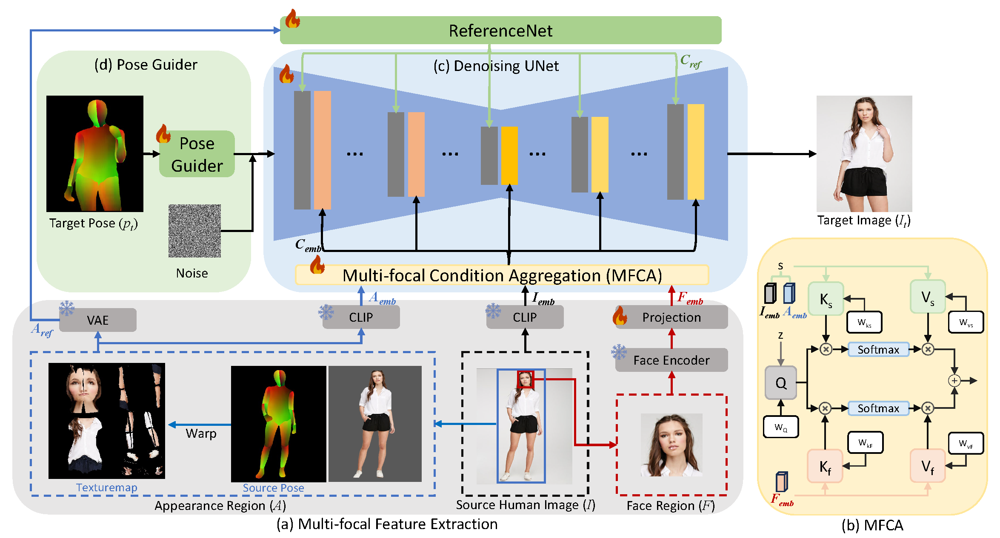

# MCLD [](https://arxiv.org/abs/2402.18078)

> **Multi-focal Conditioned Latent Diffusion for Person Image Synthesis** <br>
> _Jiaqi Liu, Jichao Zhang, Paolo Rota, Nicu Sebe_<br>
> _Computer Vision and Pattern Recognition Conference (**CVPR**), 2025, Nashville, USA_


## Generated Results
   You can directly download our test results from [Google Drive]() (Including 256x176, 512*352 on Deepfashion) for further comparison.

## Dataset

- Download `img_highres.zip` of the DeepFashion Dataset from [In-shop Clothes Retrieval Benchmark](https://drive.google.com/drive/folders/0B7EVK8r0v71pYkd5TzBiclMzR00). 

- Unzip `img_highres.zip`. You will need to ask for password from the [dataset maintainers](http://mmlab.ie.cuhk.edu.hk/projects/DeepFashion/InShopRetrieval.html). Then rename the obtained folder as **img** and put it under the `./dataset/deepfashion` directory. 

- Preprocess the pose condition with [Densepose](). Or you could also download our prepared poses on [pose.zip]().

- Preprocess the texture condition and face embedding with `data/prepare_face_texture_data.py`. Also you could download it from our prepared ones on [conditions.zip]().

- Download the train and test split fron [Google Drive](). And put it under `data/split/` folder.

## Preparation

### Install Environment

```
conda env create -f environment.yaml
```
### Download pretrained Models

1. Download pretrained weight of based models and other components and put it to the pretrained weights: 
    - [StableDiffusion V1.5](https://huggingface.co/runwayml/stable-diffusion-v1-5)
    - [sd-vae-ft-mse](https://huggingface.co/stabilityai/sd-vae-ft-mse)
    - [image_encoder](https://huggingface.co/lambdalabs/sd-image-variations-diffusers/tree/main/image_encoder)
    - [pose_guder]()

2. Download our trained checkpoints from [Google drive]().

Finally you will have your pretrained weight as this structure:

```text
./pretrained_weights/
|-- control_v11p_sd15_seg
    |-- config.json
    |-- diffusion_pytorch_model.bin
    `-- diffusion_pytorch_model.safetensors
|-- image_encoder
|   |-- config.json
|   `-- pytorch_model.bin
|-- sd-vae-ft-mse
|   |-- config.json
|   |-- diffusion_pytorch_model.bin
|   `-- diffusion_pytorch_model.safetensors
`-- stable-diffusion-v1-5
    |-- feature_extractor
    |   `-- preprocessor_config.json
    |-- model_index.json
    |-- unet
    |   |-- config.json
    |   `-- diffusion_pytorch_model.bin
    `-- v1-inference.yaml
./checkpoints/
|-- denoising_unet.pth
|-- image_projector.pth
|-- pose_guider.pth
`-- reference_unet.pth
```


## Method 



## Training

This code support multi-GPU training with `accelerate`. Full training takes `~26 hours` with 2 A100-80G GPUs with a batch size 12 on deepfashion dataset. 

```bash
accelerate launch --main_process_port 12148 train.py --config PATH_TO_CONFIG
```

## Validation 
To test our method on the whole Deepfashion dataset, run:

``` bash
test.py --save_folder FOLDER_TO_SAVE
```

Then, the results can be evaluated by:

``` bash
evaluate.py --save_folder FOLDER_TO_SAVE --gt_folder FOLDER_TO_DATASET --resolution 256
```

You could also specify your own image and pose by run:

``` bash
test_single_image.py --input_image YOUR_IMAGE --pose_condition  examples/SELECT_A_POSE
```

## Editing

MCLD allows flexible editing since it decompose the human appearance and identities. You could play the editing demo in `editing` folder.


## Citation